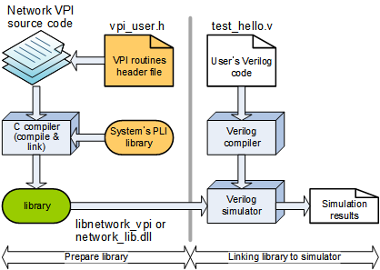

# Network VPI Library
'**Network VPI Library**' is a collection of VPI (Verilog Programming Interface) tasks that handles network packets, which include Ethernet, IP, UDP, TCP and PTPv2.

## License
This is licensed with the 2-clause BSD license to make the program and library useful in open and closed source products independent of their licensing scheme.

## Prerequisites
This program requires followings.

* Platforms: Linux, Cygwin/MinGW, Windows
* Shell: Bash or Windows BATCH
* C compiler: GCC or Visual Studio
* HDL simulator: Mentor Graphics ModelSim

# Quick start for Ethernet packet
Following Verilog code shows how to fill Ethernet packet in 'pkt_eth[][]' array.
```
module top;
... ...
reg [ 7:0] pkt_eth[0:4095];
    reg [47:0] mac_src;
    reg [47:0] mac_dst;
    reg [15:0] type_len;
    reg [15:0] bnum_payload;
    reg [ 7:0] payload[0:4095];
    reg [15:0] bnum_pkt;
    integer add_crc;
    integer add_preamble;
    integer idx;
    initial begin
          for (idx=0; idx<4096; idx=idx+1) pkt_eth[idx] = 8'hFF;
          mac_src=48'h02_12_34_56_78_9A;
          mac_dst=48'h02_11_22_33_44_55;
          for (idx=0; idx<4096; idx=idx+1) payload[idx] = idx;
          type_len=0; // 0 menas use 'bnum_payload'
          bnum_payload = 10;
          type_len = bnum_payload;
          add_crc = 0;
          add_preamble = 0;
          bnum_pkt=0
          // this task fills Ethernet packet in the ¡®pkt_eth'
          // that contains 'bnum_pkt' bytes.
          $pkt_ethernet(pkt_eth
                     ,bnum_pkt
                     ,mac_src
                     ,mac_dst
                     ,type_len
                     ,bnum_payload
                     ,payload
                     ,add_crc
                     ,add_preamble
                     );
    end
... ...
endmodule
```

Following code shows how to run ModelSim, in which a path to '*network_vpi.dll*' should be specified.
```
all: vlib vlog vsim

vlib:
    if [ -f compile.log ]; then /bin/rm -f compile.log; fi
    if [ -d work ]; then /bin/rm -rf work; fi
    vlib work 2>&1 | tee -a compile.log

vlog:
    vlog -work work top.v 2>&1 | tee -a compile.log

vsim:
    vsim -pli ..../network_vpi.dll -novopt -c -do "run -all; quit" -lib work work.top
```

# How to build library for ModelSim/QuestaSim
The picture below shows compilation and simulation flow.



### Linux
Just go to the source directory and run 'make'.

```
$ cd  vpi
$ make clean
$ make
$ make install
```

Following library should be ready, where '10.3' stands for version of ModelSim.
```
vpi_lib/modelsim/10.3/linux_x86_64/libnetwork_vpi.so
```

### MinGW on Windows
Just go to the source directory and run 'make'.

```
$ cd  vpi
$ make clean
$ make
$ make install
```

Following library should be ready, where '10.3' stands for version of ModelSim.
```
vpi_lib/modelsim/10.3/mingw_x86_64/libnetwork_vpi.so
```

### Visual Studio
Just go to the source directory and run 'nmake'.

```
> WIN_RUN.bat
> NMAKE -f NMAKEFILE clean
> NMAKE -f NMAKEFILE
> NMAKE -f NMAKEFILE install
```

Following library should be ready, where '10.3' stands for version of ModelSim.
```
vpi_lib/modelsim/10.3/MS64/network_vpi.dll
```

## Testing
When '*libnetwork_vpi.so*' or '*network_vpi.dll*' is ready,
test simple code as follows.

1. Go to 'vpi_test' directory
2. Run 'make' or 'RunMe.bat' depending on your platform.

---

### Autor(s)
* **[Ando Ki](mailto:andoki@gmail.com)** - *Initial work* - <a href="http://www.future-ds.com" target="_blank">Future Design Systems</a>

### Acknowledgments

